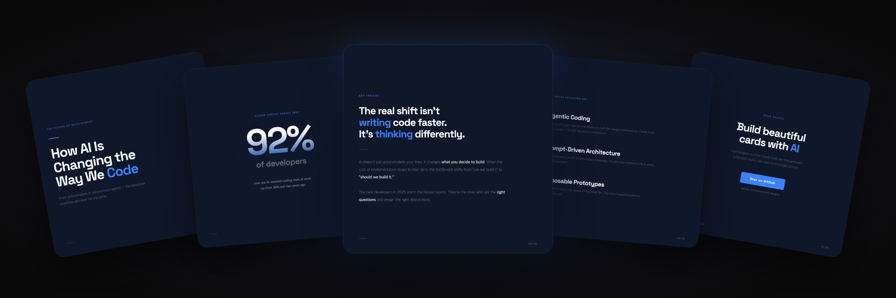

<div align="center">

<h1>card-designer</h1>

<p><strong>Carousel generators forget your brand the moment you close the tab.<br/>This one remembers — and gets sharper every session.</strong></p>

<sub>Claude Code skill · Instagram 1080×1080 · puppeteer-rendered retina · brand grammar that compounds</sub>

</div>

---

## What you ship

<p align="center">
  
</p>

Every run produces **two artifacts**, not one:

- **The carousel.** `slide_01.png … slide_NN.png` at 2160×2160 retina, ready to post.
- **Brand grammar that persists.** `brand-master.md`, `idioms.json`, `manifest.json`, an SVG library. Files that thicken each session and make the next series sharper without you doing anything.

The second artifact is the point. The first is the receipt.

---

## Install

```bash
git clone https://github.com/xhae123/card-designer.git ~/.claude/skills/card-designer
cd ~/.claude/skills/card-designer
npm install                              # puppeteer
pip3 install --break-system-packages pillow
brew install pngquant                    # optional raster compression
```

Claude Code picks it up on next session. Trigger with phrases like `card designer`, `make a carousel`, `design a carousel`.

---

## Quickstart

**1. Invoke the skill.** Use a trigger phrase. If this is your first run, you'll be walked through brand onboarding.

**2. Brand onboarding (first time only, ~15 min).** A 7-phase designer interview captures voice, mood, signature motifs, visual idioms, composition patterns, anti-patterns. Drop in any existing logo or screenshot — it's preserved pixel-perfect via SVG-wrapped base64 (the way Figma exports non-vector layers), not eye-traced and degraded. Output: a `brand-master.md` constitution and a structured asset library you own forever.

**3. Subsequent runs: one line.**

```
Make a 7-slide carousel announcing our Q3 product launch.
```

The skill loads your accumulated grammar, plans assets per slide, drafts HTML, renders via puppeteer, runs a 9-criterion aesthetic critique, optionally calls a senior-designer reviewer agent on demand, and opens the previews.

Full workflow in `SKILL.md`.

---

## Why it's different

Most carousel tools handle **surface tokens** — colors, fonts, spacing. Trivial to copy from a single screenshot. They're table stakes; they don't compound.

This skill captures the layers above:

| Layer | What it locks down | Why it can't be copied |
|---|---|---|
| **Master vocabulary** | Signature SVGs identifying your brand at thumbnail scale (mascot, recurring motifs, objects). | Earned through use. Belongs to the user, not the tool. |
| **Visual idioms** | The 8 ways your brand *specifically* expresses emphasis, lists, big numbers, dividers, success, containers, callouts, backgrounds. | One brand uses a black highlight box; another uses an orange underline; another uses a sticker burst. Pattern, not pixel. |
| **Composition patterns** | The spatial rules covers follow vs. detail slides vs. CTAs. Eye entry, rule of thirds, asset budget per series. | Encoded as enforceable rules, not preferences. |
| **Voice–visual coupling** | Which adjective ("precise", "loud", "warm") maps to which design move in *your* system. | Decided once, applied forever. |

A few things this skill does that others skip:

- **Two-protocol asset intake.** User-provided rasters go through a pixel-perfect base64-embed pipeline (zero detail loss — auto-tracers like vtracer/potrace posterize gradient illustrations and we won't ship that). AI-generated motifs are hand-crafted pure SVG with proper paths and gradients. The two protocols never get confused.
- **12-mood SVG library** lazy-loaded by need. Toss-flat, sticker-kawaii, iso-3d-gradient, memphis-revival, editorial-line, architectural-blueprint, notion-doodle, neo-brutalist, claymorphism, paper-cutout, pixel-art, y2k-vaporwave. Copy-paste snippets, lighting and color rules included.
- **Discipline vs. flexibility built in.** Enforcement levels (`hard` / `default` / `suggestion`), per-series asset budgets, context-fit checks, fresh-element imperative, deliberate-deviation logging. Stops the "every slide looks the same forever" failure mode that haunts rule-based tools.
- **Two-layer critique.** Always-on 9-criterion self-critique catches structural issues. Opt-in external designer-reviewer agent (gstack pattern) brings a fresh eye when stakes warrant it.

The bet: surface tokens are five-minute copy-jobs. Brand grammar accumulated across sessions is hours of work no competitor can lift from a screenshot. The user owns it.

---

## Project structure

```
card-designer/
├── SKILL.md                  # main workflow — load first
├── scripts/
│   ├── render.js             # puppeteer renderer
│   └── png-to-svg.py         # raster intake → embedded SVG
├── references/
│   ├── asset-language.md     # WHEN/HOW assets, two-protocol rule
│   ├── asset-moods.md        # 12-mood SVG technique library (lazy)
│   ├── onboarding-protocol.md # 7-phase brand kickoff
│   ├── visual-critique.md    # 9-criterion self-critique
│   ├── designer-reviewer.md  # opt-in external reviewer agent
│   ├── canvas.md / typography.md / layout.md / color.md
│   ├── card-types.md / content-principles.md / anti-patterns.md
│   ├── quality-gates.md / font-presets.md / visual-effects.md
│   └── external-references.md
└── brands/{name}/            # per-brand accumulated state (gitignored)
    ├── brand-master.md       # the constitution
    ├── idioms.json           # machine-readable expression rules
    ├── manifest.json         # asset index (tier/tags/budget/contextFit)
    ├── evolution.md          # append-only brand version log
    ├── timeline.jsonl        # session events
    └── assets/{logo.svg, signature/, library/, raw/}
```

Brand directories are user data and stay out of git.

---

## Docs

- **`SKILL.md`** — full workflow
- **`references/asset-language.md`** — asset philosophy and two-protocol rule
- **`references/onboarding-protocol.md`** — the designer kickoff interview
- **`references/asset-moods.md`** — SVG mood library with copy-paste snippets

---

## Contributing

Issues and pull requests via [GitHub](https://github.com/xhae123/card-designer). Bug reports are most useful when they include the rendered carousel and the brand profile that produced it.

## License

MIT.
